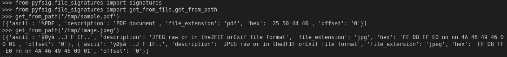

# How to use pysig

## Step 1: Clone the git-repo
```
git clone git@github.com:schlerp/pyfsig.git
```

## Step 2: Install requirements from pysig
```
python3 setup.py install
```

## Step 3: Sample code
```
>>> from pyfsig.file_signatures import signatures
>>> from pyfsig.file_signatures import get_from_file,get_from_path
>>> get_from_path('/tmp/sample.pdf')

[{'ascii': '%PDF', 'description': 'PDF document', 'file_extension': 'pdf', 'hex': '25 50 44 46', 'offset': '0'}]

>>> get_from_path('/tmp/image.jpeg')

[{'ascii': 'ÿØÿà ..J F IF..', 'description': 'JPEG raw or in theJFIF orExif file format', 'file_extension': 'jpg', 'hex': 'FF D8 FF E0 nn nn 4A 46 49 46 00 01', 'offset': '0'}, {'ascii': 'ÿØÿà ..J F IF..', 'description': 'JPEG raw or in theJFIF orExif file format', 'file_extension': 'jpeg', 'hex': 'FF D8 FF E0 nn nn 4A 46 49 46 00 01', 'offset': '0'}]
```


